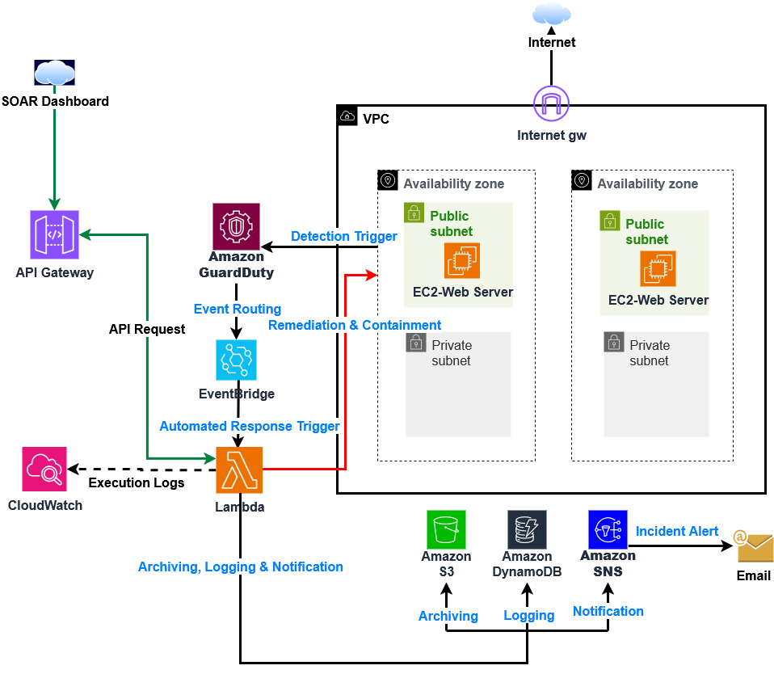
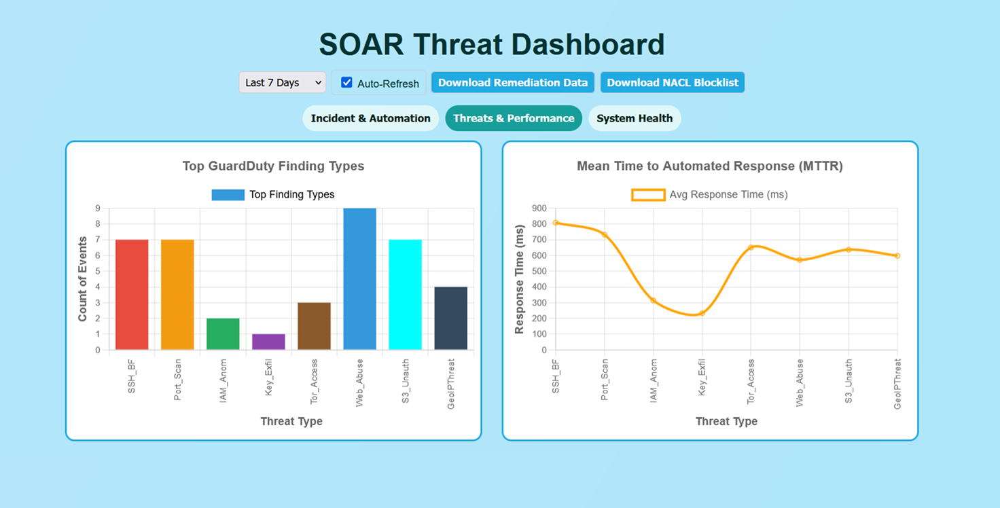
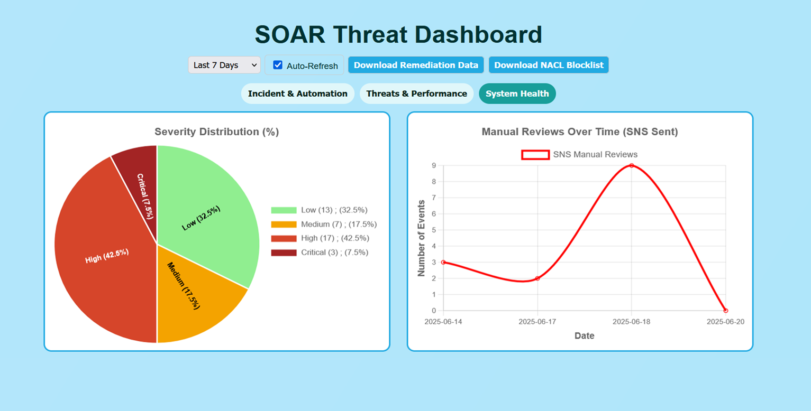

# Cloud-Based Serverless Security Orchestration, Automation, and Response (SOAR) System on AWS  

## Project Overview  
This project demonstrates the design and implementation of a **cloud-native, serverless SOAR system** on AWS. It was developed as a **capstone project for Cybersecurity potsgraduate certificate program at Saskatchewan Polytechnic** to provide small and medium-sized organizations with a **cost-effective incident response framework**.  

The solution leverages **AWS GuardDuty for continuous threat detection, EventBridge for orchestration, Lambda for remediation, DynamoDB and S3 for structured logging, and SNS for real-time alerts**. A GitHub-hosted dashboard integrates with API Gateway to provide **real-time visibility into threats, remediation outcomes, and performance metrics**.  

---

## Objectives  
- Implement a **fully automated incident response pipeline** using AWS-native services.  
- Enable **real-time threat detection** through GuardDuty and custom triggers.  
- Orchestrate **automated remediation playbooks** with Lambda and EventBridge.  
- Provide **auditable logging** in DynamoDB and S3.  
- Deliver **alerts and notifications** via SNS.  
- Visualize detections and responses with a **custom SOAR dashboard**.  

---

## Tools and Technologies  
- **AWS Services**: VPC, EC2, GuardDuty, EventBridge, Lambda, DynamoDB, S3, API Gateway, SNS  
- **Infrastructure as Code**: AWS CloudFormation  
- **Testing Environment**: Kali Linux for controlled attacks and simulations  
- **Dashboard**: GitHub Pages (HTML/CSS/JS + Chart.js)  

---

## Key Features  
- **Automated Playbooks** for eight scenarios:  
  - SSH Brute Force  
  - Port Scanning  
  - IAM Anomalous Behavior  
  - IAM Credential Exfiltration  
  - Web Login Abuse (custom)  
  - Tor Access  
  - GeoIP Threats  
  - S3 Unauthorized Access  

- **Structured Logging**:  
  - DynamoDB tables for ThreatMetadata, RemediationLog, and NACLBlockList.  
  - S3 for archival of GuardDuty findings and forensic data.  

- **Alerting and Visibility**:  
  - Real-time SNS notifications for security stakeholders.  
  - Interactive dashboard for threats, MTTR, severity breakdown, and automation rate.  

- **Cost Awareness**:  
  - Built and tested within AWS Free Tier, minimizing operational costs.  

---

## System Architecture  
The SOAR system is deployed as a **modular serverless architecture**.  

  
*Figure 1: System Architecture of the Cloud-Based SOAR Framework*  

---

## Dashboard Overview  
The SOAR Dashboard provides **real-time visibility** into threats and responses.  






*Figure 2: Dashboard interface with threat, severity, and remediation insights*  

---

## Repository Structure  
```
Cloud-Based-Soar/
├── code/
│   ├── CloudFormation/
│   │   ├── capstone-s3.yml
│   │   ├── dynamodb_sns.yml
│   │   ├── geoip_threat_event_rule.yml
│   │   ├── guardduty.yml
│   │   ├── iam_anomaly_event_rule.yml
│   │   ├── iam_exfiltration_event_rule.yml
│   │   ├── log_metadata_function.yml
│   │   ├── nacl_cleanup_event_rule.yml
│   │   ├── port_scanning_event_rule.yml
│   │   ├── s3_unauthorized_access_event_rule.yml
│   │   ├── soar_containments_master.yml
│   │   ├── soar_data_api.yml
│   │   ├── ssh_brute_force_event_rule.yml
│   │   ├── tor_access_event_rule.yml
│   │   ├── vpc_ec2.yml
│   │   └── web_login_abuse_event_rule.yml
│   │
│   ├── Github_UI/
│   │   ├── index.html
│   │   ├── script.js
│   │   └── style.css
│   │
│   ├── Lambda/
│   │   ├── Containment/
│   │   │   ├── geoip_threat_lambda.py
│   │   │   ├── iam_anomaly_lambda.py
│   │   │   ├── iam_exfiltration_lambda.py
│   │   │   ├── port_scanning_lambda.py
│   │   │   ├── s3_unauthorized_access_lambda.py
│   │   │   ├── ssh_brute_force_lambda.py
│   │   │   ├── tor_access_lambda.py
│   │   │   └── web_login_abuse_lambda.py
│   │   ├── api_soar_data.py
│   │   ├── logMetadataFunction.py
│   │   └── nacl_cleanup_lambda.py
│   │
│   ├── Simple_web/
│   │   ├── dashboard.html
│   │   ├── login.html
│   │   └── login.php
│   │
│   └── iam_policy/
│       └── iam_policy.json
│
├── docs/
│   ├── Capstone-Summary.pdf
│   ├── SOAR-Containment-Playbook.xlsx
│   ├── SOAR-Architecture-Diagram.pdf
│   ├── SOAR-Architecture.png
│   ├── SOAR-Dashboard-Screenshot.pdf
│   ├── SOAR-Incident-Category.png
│   ├── SOAR-System-Health.png
│   ├── SOAR-Threat-Type.png
│   └── SOAR_Step_by_Step_Deployment-Guide.pdf
│
├── README.md
└── SECURITY.md

```

---

## Step-by-Step Deployment  
The full procedure is documented in the **SOAR Step-by-Step Deployment Guide** (`/docs/SOAR_Step_by_Step_Deployment-Guide.pdf`).  

**High-level phases:**  
1. Deploy VPC and EC2 demo instance.  
2. Deploy S3 bucket and enable GuardDuty.  
3. Deploy DynamoDB tables and SNS topics.  
4. Package and upload Lambda functions.  
5. Deploy EventBridge rules via CloudFormation.  
6. Attach IAM policies with least privilege.  
7. Deploy API Gateway for dashboard integration.  
8. Host dashboard on GitHub Pages.  
9. Validate via manual and live attack simulations.  

---

## Testing and Validation  
- **Manual Payloads**: Included for each playbook to simulate GuardDuty findings.  
- **Controlled Attacks**: Kali Linux used for SSH brute force, Nmap port scanning, and S3 policy abuse.  
- **Dashboard Metrics**: Confirmed Mean Time to Respond (MTTR), remediation success, and SOC review classification.  

---

## Notes  
- Replace all AWS account IDs, ARNs, and credentials with placeholders before publishing.  
- Use only **safe demonstration targets** such as `http://testphp.vulnweb.com`.  
- Ensure IAM policies follow **least privilege**.  
- System should only be used on environments you own or have explicit authorization to test.  

---

## License  
This repository is provided for **educational and demonstration purposes**. Use responsibly and in compliance with all applicable laws.  
